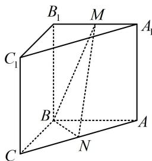

<!-- question-source:start -->
【例 1】(2022·北京卷（节选）) 如图，三棱柱 $ABC-A_{1}B_{1}C_{1}$ 中，侧面 $BCC_{1}B_{1}$ 为正方形，平面 $BCC_{1}B_{1} \perp$ 平面 $ABB_{1}A_{1}$ ，AB = BC = 2，M，N 分别为 $A_{1}B_{1}$ ，AC 的中点。证明：MN// 平面 $BCC_{1}B_{1}$ 。

<!-- question-source:end -->

![[高中/总复习/教辅/一数常规版2026/第9章 立体几何、空间向量/模块2 位置关系的判定/第1节 平行关系证明思路大全/类型01_找平行四边形/例题/answers/Q00050566A1.md]]
