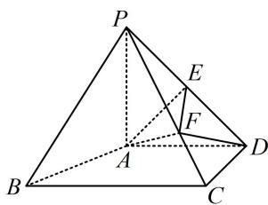

<!-- question-source:start -->
【变式1】如图，在四棱锥 $P - ABCD$ 中， $PA \perp$ 平面 $ABCD$ ， $AD \perp CD$ ， $AD \parallel BC$ ，且 $PA = AD = CD = 2$ ， $BC = 3$ ， $E$ 是 $PD$ 的中点，点 $F$ 在 $PC$ 上，且 $PF = 2FC$ 。证明： $DF \parallel$ 平面 $PAB$ .

<!-- question-source:end -->

![[高中/总复习/教辅/一数常规版2026/第9章 立体几何、空间向量/模块2 位置关系的判定/第1节 平行关系证明思路大全/类型01_找平行四边形/例题/answers/Q00050567A1.md]]
