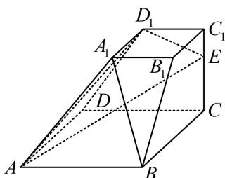

<!-- question-source:start -->
【变式2】如图，四棱台 $ABCD - A_{1}B_{1}C_{1}D_{1}$ 的下底面和上底面分别是边长为4和2的正方形，侧棱 $CC_{1}$ 上的点 $E$ 满足 $\frac{C_1E}{C_1C} = \frac{1}{3}$ ，证明：直线 $A_{1}B //$ 平面 $AD_{1}E$ .

<!-- question-source:end -->

![[高中/总复习/教辅/一数常规版2026/第9章 立体几何、空间向量/模块2 位置关系的判定/第1节 平行关系证明思路大全/类型01_找平行四边形/例题/answers/Q00050568A1.md]]
