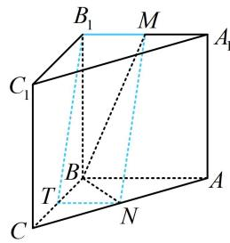

> [!faq]- 《第1节 平行关系证明思路大全》例题解析
>
> > [!success]- **【答案】** 详见解析
>
> > [!note]- **【分析】**
> > 本题未单列分析。
>
> > [!note]- **【解析】**
> > 证明：MN// 平面 $BCC_{1}B_{1}$ 。
> >
> > 
> >
> > 证明：（要证线面平行，先考虑在面内找与已知直线平行的直线，故尝试过 $B_{1}$ 作 $MN$
> >
> > 的平行线 $B_{1}T$ ，作出来就发现 $B_{1}MNT$ 像平行四边形，思路就出来了。可以发现 $T$ 的位置很像中点，故取中
> >
> > 点尝试）如图，取 $BC$ 中点 $T$ ，连接 $B_{1}T$ ，TN，因为 $N$ 是 $AC$ 中点，所以 $TN \parallel AB$ 且 $TN = \frac{1}{2} AB$ ，又 $M$ 是 $A_{1}B_{1}$ 的中点，所以 $B_{1}M \parallel AB$ 且 $B_{1}M = \frac{1}{2} AB$ ，故 $TN \parallel B_{1}M$ 且 $TN = B_{1}M$ 所以四边形 $B_{1}MNT$ 为平行四边形，故 $MN \parallel B_{1}T$ 因为 $MN \not\subset$ 平面 $BCC_{1}B_{1}$ ， $B_{1}T \subset$ 平面 $BCC_{1}B_{1}$ ，所以 $MN \parallel$ 平面 $BCC_{1}B_{1}$ .
> >
> > 
