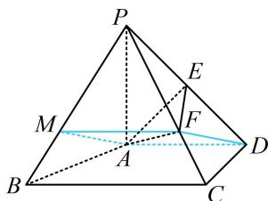

> [!faq]- 《第1节 平行关系证明思路大全》例题解析
>
> > [!success]- **【答案】** 详见解析
>
> > [!note]- **【分析】**
> > 本题未单列分析。
>
> > [!note]- **【解析】**
> > 证明： $DF \parallel$ 平面 $PAB$ .
> >
> > 
> >
> > 证明：（过 $A$ 作 $DF$ 的平行线交 $PB$ 于 $M$ ， $MADF$ 很像平行四边形，但 $M$ 不像中点。要确定 $M$ 的位置，可逆推，若 $MADF$ 是平行四边形，则 $MF \parallel AD$ ，而 $AD \parallel BC$ ，故 $MF \parallel BC$ ， $M$ 在 $PB$ 上的位置就找到了）在棱 $PB$ 上取点 $M$ ，使 $PM = 2MB$ ，因为 $PF = 2FC$ ，所以 $MF \parallel BC$ ，且 $MF = \frac{2}{3}BC$ ，
> >
> > 又由题意， $AD \parallel BC$ ，且 $AD = 2$ ， $BC = 3$ ，所以 $AD = \frac{2}{3}BC$ ，
> >
> > 故 $MF \parallel AD$ 且 $MF = AD$ ，所以四边形 $MADF$ 是平行四边形，故 $DF \parallel AM$ ，又 $DF \not\subset$ 平面 $PAB$ ， $AM \subset$ 平面 $PAB$ ，所以 $DF \parallel$ 平面 $PAB$ .
> >
> > 
