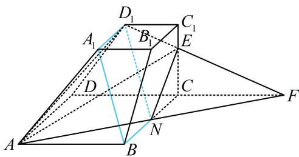

> [!faq]- 《第1节 平行关系证明思路大全》例题解析
>
> > [!success]- **【答案】** 详见解析
>
> > [!note]- **【分析】**
> > 本题未单列分析。
>
> > [!note]- **【解析】**
> > 证明: (过 $D_{1}$ 作 $A_{1}B$ 的平行线, 若另一端点取在 $AE$ 上, 则其位置不好确定, 且不构成平行四边形, 这是因为 $AD_{1}E$ 还不是四棱台的完整截面, 得把完整的截面画出来, 才能看出端倪. 要画此截面, 可延长截面 $AD_{1}E$ 中位于表面的线来扩大截面, 所以我们延长 $D_{1}E$ , 找它与棱 $DC$ 的交点)
> >
> > 如图，延长 $D_{1}E$ ， $DC$ 交于点 $F$ ，则 $F$ 为面 $AD_{1}E$ 和面ABCD的一个公共点，
> >
> > 又 $A$ 也为此二面的公共点，所以连接 $AF$ 交 $BC$ 于 $N$ ，则 $AF$ 即为面 $AD_{1}E$ 和面 $ABCD$ 的交线，连接 $NE$ （截面就补充完整了，此时我们再观察图形，发现 $D_{1}N$ 就是要找的平行线，下面先论证 $N$ 的位置）由图可知 $\triangle EC_{1}D_{1}\sim \triangle ECF$ ，所以 $\frac{C_1D_1}{CF} = \frac{C_1E}{CE} = \frac{1}{2}$ ，故 $CF = 2C_{1}D_{1} = 4$ 所以 $CF = AB$ ，结合 $\angle FCN = \angle ABN = 90^{\circ}$ ， $\angle CNF = \angle BNA$ 可得 $\triangle ABN\cong \triangle FCN$
> >
> > 所以 $NB = NC$ ，从而 $N$ 为 $BC$ 中点，故 $BN = 2 = A_{1}D_{1}$ 又 $A_{1}D_{1} \parallel B_{1}C_{1}$ ， $BN \parallel B_{1}C_{1}$ ，所以 $A_{1}D_{1} \parallel BN$ 从而四边形 $A_{1}D_{1}NB$ 是平行四边形，故 $A_{1}B \parallel D_{1}N$ 又 $A_{1}B \not\subset$ 平面 $AD_{1}E$ ， $D_{1}N \subset$ 平面 $AD_{1}E$ 所以 $A_{1}B \parallel$ 平面 $AD_{1}E$
> >
> > 
>
> > [!tip]- **【总结】**
> > - **①**：证线面平行，先尝试找线，可在已知平面内作已知直线的
> >
> > 平行线，观察所得图形的特征，如有无平行四边形等；
> > - **②**：取中点连线是立几大题里频率最高的辅助线作法，但不是唯一的作法；
> > - **③**：若截面不完整，可尝试画出完整截面再观察.
