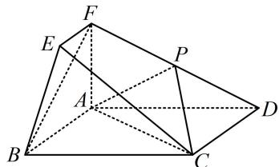

<!-- question-source:start -->
【例2】如图, 四边形ABCD为矩形, AF⊥平面ABCD, EF∥AB, AD=2, AB=AF=2EF=1, 点P为DF的中点. 证明: BF∥平面APC.

<!-- question-source:end -->

![[高中/总复习/教辅/一数常规版2026/第9章 立体几何、空间向量/模块2 位置关系的判定/第1节 平行关系证明思路大全/类型02_两个重要图形的运用/例题/answers/Q00050569A1.md]]
