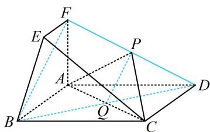

> [!faq]- 《第1节 平行关系证明思路大全》例题解析
>
> > [!success]- **【答案】** 详见解析
>
> > [!note]- **【分析】**
> > 本题未单列分析。
>
> > [!note]- **【解析】**
> > 证明: (若过 $P$ 在面内作 $BF$ 的平行线, 可发现得到的显然不是平行四边形, 那怎么办? 我们发现 $BF$ 和 $D$ 分居于面 $APC$ 两侧, 由内容提要 2 的①可知只需连接 $FD$ , $BD$ , 证明 $BF$ 平行于交线 $PQ$ 即可)
> >
> > 如图，连接 $BD$ 交 $AC$ 于点 $Q$ ，连接 $PQ$
> >
> > 因为四边形 $ABCD$ 为矩形，所以 $Q$ 为 $BD$ 中点，
> >
> > 又 P 为 DF 中点，所以 $PQ \parallel BF$ ，
> >
> > 因为 $BF \not\subset$ 平面 $APC, PQ \subset$ 平面 $APC$ , 所以 $BF \parallel$ 平面 $APC$ .
> >
> > 
