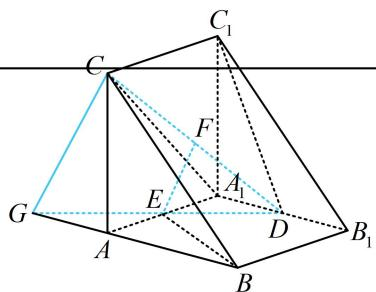

> [!faq]- 《第1节 平行关系证明思路大全》例题解析
>
> > [!success]- **【答案】** 详见解析
>
> > [!note]- **【分析】**
> > 本题未单列分析。
>
> > [!note]- **【解析】**
> > 证明: (相对于 $EF$ , 面 $ABC$ 的对侧没有点, 但观察发现 $CF$ 上有点 $D$ , 且 $D$ 和 $EF$ 位于面 $ABC$ 的同侧, 符合内容提要 2 中②的重要图形, 故连接 $DE$ 并延长, 找到与面 $ABC$ 的交点, 平行线就作出来了)
> >
> > 
> >
> > 如图，延长 DE 和 BA 交于点 G，连接 CG，
> >
> > 由题意，面 $ABB_{1}A_{1}$ 是矩形，E 为 $AA_{1}$ 中点，
> >
> > 所以 $\angle EAG = \angle EA_{1}D = 90^{\circ}$ ， $AE = A_{1}E$
> >
> > 又 $\angle AEG = \angle A_{1}ED$ ，所以 $\triangle AEG\cong \triangle A_{1}ED$ ，故 $GE = DE$ 所以 E 为 GD 中点，又 F 是 CD 中点，所以 $EF \parallel CG$ ，
> > 因为 $EF \not\subset$ 平面 ABC, $CG \subset$ 平面 ABC, 所以 $EF \parallel$ 平面 ABC.
>
> > [!tip]- **【总结】**
> > 可以发现，只要题目中出现了两个重要图形，对应连线就可轻松找到思路.
> >
> > 
