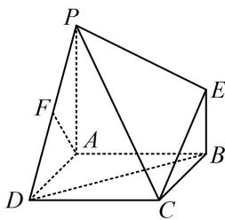

<!-- question-source:start -->
【例4】如图, 四边形ABCD是正方形, $PA \perp$ 平面ABCD, $EB \parallel PA$ , $AB = PA = 4$ , $EB = 2$ , $F$ 为PD的中点, 证明: $BD \parallel$ 平面PEC.

<!-- question-source:end -->

![[高中/总复习/教辅/一数常规版2026/第9章 立体几何、空间向量/模块2 位置关系的判定/第1节 平行关系证明思路大全/类型03_造面面平行的思路/例题/answers/Q00050572A1.md]]
