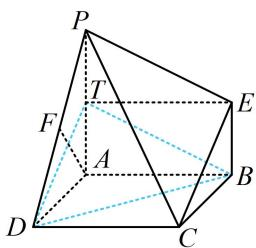

> [!faq]- 《第1节 平行关系证明思路大全》例题解析
>
> > [!success]- **【答案】** 详见解析
>
> > [!note]- **【分析】**
> > 本题未单列分析。
>
> > [!note]- **【解析】**
> > 证明: (过 $E$ 在 $\triangle PEC$ 内作 $BD$ 的平行线, 不构成 $\square$ , 同侧与对面也没有点, 咋办? 这种情况可尝试造面, 先找过 $B$ 与面 $PEC$ 平行的直线, 可过 $B$ 作 $PE$ 的平行线 $BT$ , 则 $BT \parallel$ 面 $PEC$ , 接下来只需证 $TD \parallel$ 面 $PEC$ 即可, 显然可以猜想 $T$ 为 $PA$ 中点)
> >
> > 如图，取 $PA$ 中点 $T$ ，连接 $BT$ ， $DT$ ， $TE$ ，因为 $PA = 4$ ，所以 $PT = 2$ ，又 $EB = 2$ ，所以 $PT = EB$ ，结合 $EB \parallel PA$ 可得四边形BEPT是平行四边形，所以 $BT \parallel PE$ 因为 $BT \not\subset$ 平面PCE， $PE \subset$ 平面PCE，所以 $BT \parallel$ 平面PCE①，
> >
> > 又 $AT = BE = 2$ ， $AT / / BE$ ，所以四边形ABET是平行四边形，故 $TE / / AB$ 且 $TE = AB$ 因为四边形ABCD是正方形，所以 $CD / / AB$ 且 $CD = AB$ ，故 $TE / / CD$ 且 $TE = CD$ 所以四边形CDTE为平行四边形，故 $DT / / CE$
> >
> > 因为 $DT \not\subset$ 平面 $PCE, CE \subset$ 平面 $PCE$ , 所以 $DT \parallel$ 平面 $PCE$ ②, 因为 $DT, BT \subset$ 平面 $BDT, DT \cap BT = T$ , 结合①②得平面 $BDT \parallel$ 平面 $PCE$ , 又 $BD \subset$ 平面 $BDT$ , 所以 $BD \parallel$ 平面 $PCE$ .
> >
> > 
>
> > [!tip]- **【总结】**
> > 通过构造面面平行来证线面平行，常见的方法是过线段端点作面的平行线.
