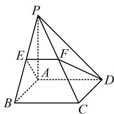

<!-- question-source:start -->
【例 5】如图，在四棱锥 P-ABCD 中，底面 ABCD 是正方形，点 F 为棱 PC 上的点，平面 ADF 与棱 PB 交于点 E，证明：EF//AD.

<!-- question-source:end -->

![[高中/总复习/教辅/一数常规版2026/第9章 立体几何、空间向量/模块2 位置关系的判定/第1节 平行关系证明思路大全/类型04_线面平行_面面平行的性质定理的应用/例题/answers/Q00050573A1.md]]
