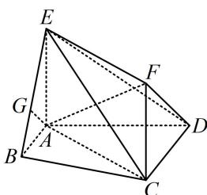

<!-- question-source:start -->
【例6】如图,矩形ACFE中, $AE = 1$ , $AE \perp$ 平面ABCD, $AB // CD$ , $\angle BAD = 90^{\circ}$ $AB = 1$ , $AD = CD = 2$ , 平面ADF与棱BE交于点G, 求证: $AG // DF$ .

<!-- question-source:end -->

![[高中/总复习/教辅/一数常规版2026/第9章 立体几何、空间向量/模块2 位置关系的判定/第1节 平行关系证明思路大全/类型04_线面平行_面面平行的性质定理的应用/例题/answers/Q00050574A1.md]]
