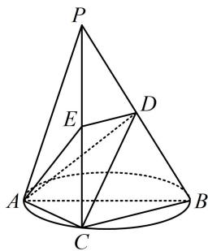

<!-- question-source:start -->
1. (2023·四川成都模拟（节选）·★★）

如图，在三棱锥 $P - ABC$ 中， $AB$ 是 $\triangle ABC$ 的外接圆直径， $PC$ 垂直于圆所在的平面， $D$ ， $E$ 分别是棱 $PB$ ， $PC$ 的中点，证明： $DE \perp$ 平面 $PAC$ .

<!-- question-source:end -->

![[Q00050590A1]]
