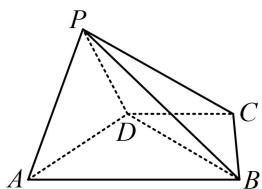

<!-- question-source:start -->
2.（2023·陕西榆林一模（节选）·★★）

如图，在四棱锥 $P - ABCD$ 中，平面 $PAD \perp$ 平面 $ABCD, AB \parallel CD, \angle DAB = 60^\circ, PA \perp PD$ ，且 $PA = PD = \sqrt{2}$ ， $AB = 2CD = 2$ ，证明： $AD \perp PB$ .

<!-- question-source:end -->

![[Q00050591A1]]
