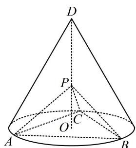

<!-- question-source:start -->
3. (2020·新课标Ⅰ卷（节选）·★★☆)

如图， $D$ 为圆锥的顶点， $O$ 是圆锥底面的圆心， $\triangle ABC$ 是底面的内接正三角形， $P$ 为 $DO$ 上一点， $\angle APC = 90^{\circ}$ ，证明：平面 $PAB\bot$ 平面 $PAC.$

<!-- question-source:end -->

![[Q00050592A1]]
