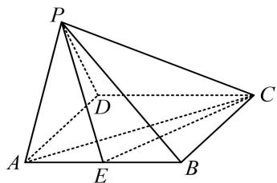

<!-- question-source:start -->
## 4. (2023·湖南模拟（节选）·★★☆)

如图, 在四棱锥 $P - ABCD$ 中, 平面 $PAD \perp$ 平面 $ABCD$ , 底面 $ABCD$ 是菱形, $\triangle PAD$ 是正三角形, $\angle ABC = \frac{2\pi}{3}$ , $E$ 是 $AB$ 的中点, 证明: $AC \perp PE$ .

## 一数·必刷100讲
<!-- question-source:end -->

![[Q00050593A1]]
