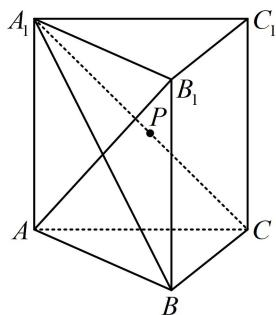

<!-- question-source:start -->
5. (2024·河南模拟（节选）·★★★)

如图，在三棱柱 $ABC - A_{1}B_{1}C_{1}$ 中， $AA_{1} \perp$ 平面 $ABC$ ， $AB_{1} \perp A_{1}C$ ， $AB \perp BC$ ， $AB = BC = 2$ ，求证： $AB_{1} \perp$ 平面 $A_{1}BC$ 。

<!-- question-source:end -->

![[Q00050594A1]]
