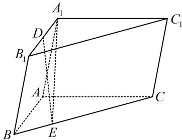

<!-- question-source:start -->
6.（2024·湖北武汉四调（节选）·★★★☆）

如图，三棱柱 $ABC - A_{1}B_{1}C_{1}$ 中，侧面 $ABB_{1}A_{1}\perp$ 底面 $ABC$ ， $AB = BB_{1} = 2$ ， $AC = 2\sqrt{3}$ ， $\angle B_1BA = 60^\circ$ ，点 $D$ 是棱 $A_{1}B_{1}$ 的中点， $\overrightarrow{BC} = 4\overrightarrow{BE}$ ， $DE\perp BC$ ，证明： $AC\perp BB_{1}$

一数·必刷100讲
<!-- question-source:end -->

![[Q00050595A1]]
