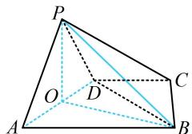

> [!faq]- 《第2节 垂直关系证明思路大全》参考答案
>
> > [!success]- **【答案】** 详见解析
>
> > [!note]- **【分析】**
> > 本题未单列分析。
>
> > [!note]- **【解析】**
> > 证明：（条件中有面 $PAD \perp$ 面 $ABCD$ , 可构造线面垂直, 找
> >
> > 
> >
> > 到 $PB$ 在平面 $ABCD$ 内的射影, 结合三垂线定理, 我们发现只需证 $AD$ 与该射影垂直即可)
> >
> > 如图，取 $AD$ 中点 $O$ ，连接 $OP$ ，OB，因为 $PA = PD =$
> >
> > $\sqrt{2}$ ，所以 $PO \perp AD$ ，又 $PA \perp PD$ ，所以 $AD = 2$
> >
> > 因为 $AB = 2$ ， $\angle DAB = 60^{\circ}$ ，所以 $\triangle ADB$ 是正三角形，
> >
> > 故 $AD \perp OB$ ，因为 $OP, OB \subset$ 平面 $POB, OP \cap OB = O$
> >
> > 所以 $AD \perp$ 平面 $POB$ ，又 $PB \subset$ 平面 $POB$ ，所以 $AD \perp PB$ .
> >
> > 
