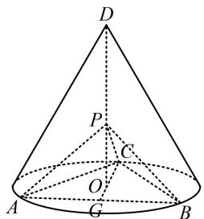
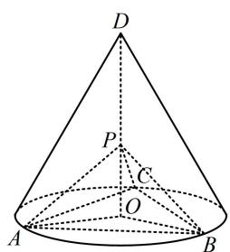

> [!faq]- 《第2节 垂直关系证明思路大全》参考答案
>
> > [!success]- **【答案】** 详见解析
>
> > [!note]- **【分析】**
> > 本题未单列分析。
>
> > [!note]- **【解析】**
> > 证法1：（要证面面垂直，又已知交线，故只需在一个面内）
> >
> > 找与交线垂直的直线，它必垂直于另一个面，由 $\angle APC = 90^{\circ}$ 可发现应选 $PC$ ，证 $PC \perp$ 面 $PAB$ 即可，而要证这一结果，还需证 $PC \perp AB$ 或 $PB$ ，下面先考虑证 $PC \perp AB$ ，注意到 $PC$ 在面 $ABC$ 内的射影是 $CO$ ，故只需证 $AB \perp CO$ ）如图1，连接 $CO$ 并延长，交 $AB$ 于点 $G$ 则 $G$ 为 $AB$ 中点，且 $AB \perp CG$ ，因为 $PO \perp$ 平面 $ABC$ ， $AB \subset$ 平面 $ABC$ ，所以 $AB \perp PO$ 又 $CG, PO \subset$ 平面 $POC$ ， $CG \cap PO = O$ 所以 $AB \perp$ 平面 $POC$ 因为 $PC \subset$ 平面 $POC$ ，所以 $AB \perp PC$ 由题意， $\angle APC = 90^{\circ}$ ，所以 $PA \perp PC$ 又 $PA$ ， $AB \subset$ 平面 $PAB$ ， $PA \cap AB = A$ 所以 $PC \perp$ 平面 $PAB$ 因为 $PC \subset$ 平面 $PAC$ ，所以平面 $PAB \perp$ 平面 $PAC.$
> >
> > 证法2：（也可通过证 $PC \perp PB$ 来证 $PC \perp$ 平面 $PAB$ ，只需证 $\triangle PAC \cong \triangle PBC$ ，观察发现又只需证 $PA = PB$ ，要证这一结果，可通过证 $\triangle POA \cong \triangle POB$ 来完成）  
> > 如图2，连接 $OA, OB$ ，则 $OA = OB$ ，由题意， $PO \perp$ 平面 $ABC, OA, OB \subset$ 平面 $ABC$ ，所以 $PO \perp OA, PO \perp OB$ ，故 $\angle POA = \angle POB = 90^\circ$ ，结合 $PO = PO$ 可得 $\triangle POA \cong \triangle POB$ ，所以 $PA = PB$ ，又 $\triangle ABC$ 是正三角形，所以 $AC = BC$ ，结合 $PC = PC$ 可得 $\triangle PAC \cong \triangle PBC$ ，所以 $\angle BPC = \angle APC = 90^\circ$ ，故 $PC \perp PB, PC \perp PA$ ，又 $PA, PB \subset$ 平面 $PAB, PA \cap PB = P$ ，所以 $PC \perp$ 平面 $PAB$ ，因为 $PC \subset$ 平面 $PAC$ ，所以平面 $PAB \perp$ 平面 $PAC$ .
> >
> >   
> > 图1
> >
> >   
> > 图2
