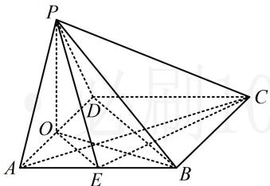

> [!faq]- 《第2节 垂直关系证明思路大全》参考答案
>
> > [!success]- **【答案】** 详见解析
>
> > [!note]- **【分析】**
> > 本题未单列分析。
>
> > [!note]- **【解析】**
> > 证明：（证线线垂直，需找线面垂直，若无思路，可尝试逆
> >
> > 推. 假设 $AC \perp PE$ , 若能再找一个与 $AC$ 或 $PE$ 有关的线线垂直与之组合, 就能得到线面垂直, 找谁呢? 看到面 $PAD \perp$ 面 $ABCD$ , 想到最常见的辅助线: 过 $P$ 作 $AD$ 的垂线 $PO$ , 得到 $PO \perp$ 底面 $ABCD$ , 于是 $PO \perp$ 该面内所有直线, 哪条有用呢? 显然是 $AC$ , 故可通过证 $AC \perp$ 面 $POE$ 来证本题的结论)  
> > 如图, 取 $AD$ 中点 $O$ , 连接 $PO$ , $OE$ , 因为 $\triangle PAD$ 是正三角形, $O$ 是 $AD$ 的中点, 所以 $PO \perp AD$ , 因为平面 $PAD \perp$ 平面 $ABCD$ , 且平面 $PAD \cap$ 平面 $ABCD = AD$ , $PO \subset$ 平面 $PAD$ , 所以 $PO \perp$ 平面 $ABCD$ , 因为 $AC \subset$ 平面 $ABCD$ , 所以 $AC \perp PO$ ①, 因为 $ABCD$ 是菱形, 所以 $AC \perp BD$ , 又因为 $O$ , $E$ 分别为 $AD$ , $AB$ 的中点, 所以 $OE \parallel BD$ , 故 $AC \perp OE$ , 结合①以及 $PO$ , $OE \subset$ 平面 $POE$ , $PO \cap OE = O$ 可得 $AC \perp$ 平面 $POE$ , 因为 $PE \subset$ 平面 $POE$ , 所以 $AC \perp PE$ .
> >
> > 
