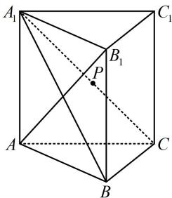

> [!faq]- 《第2节 垂直关系证明思路大全》参考答案
>
> > [!success]- **【答案】** 详见解析
>
> > [!note]- **【分析】**
> > 本题未单列分析。
>
> > [!note]- **【解析】**
> > 证明：(要证 $AB_{1} \perp$ 面 $A_{1}BC$ , 需证 $AB_{1} \perp$ 该面内的两条)
> >
> > 相交直线. 已有 $AB_{1} \perp A_{1}C$ ，另一条选谁呢？不外乎 $A_{1}B$ 或 $BC$ ，题干还给出了 $AB \perp BC$ ，故考虑选 $BC$ ，怎样证 $AB_{1} \perp BC$ ？若无思路，可尝试逆推，假设 $AB_{1} \perp BC$ ，结合 $AB \perp BC$ 可得 $BC \perp$ 面 $ABB_{1}A_{1}$ ，故可通过证此线面垂直来证明 $AB_{1} \perp BC$ ）因为 $AA_{1} \perp$ 平面 $ABC$ ， $BC \subset$ 平面 $ABC$ ，所以 $AA_{1} \perp BC$ ，又 $AB \perp BC$ ， $AB \subset$ 平面 $ABB_{1}A_{1}$ ， $AA_{1} \subset$ 平面 $ABB_{1}A_{1}$ ， $AB \cap AA_{1} = A$ ，所以 $BC \perp$ 平面 $ABB_{1}A_{1}$ ，因为 $AB_{1} \subset$ 平面 $ABB_{1}A_{1}$ ，所以 $AB_{1} \perp BC$ ，
> >
> > 因为 $AB_{1} \perp A_{1}C$ ，且 $A_{1}C$ ， $BC \subset$ 平面 $A_{1}BC$ ，
> >
> > $A_{1}C \cap BC = C$ ，所以 $AB_{1} \perp$ 平面 $A_{1}BC$ ：
> >
> > 
