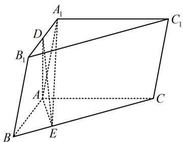

> [!faq]- 《第2节 垂直关系证明思路大全》参考答案
>
> > [!success]- **【答案】** 详见解析
>
> > [!note]- **【分析】**
> > 本题未单列分析。
>
> > [!note]- **【解析】**
> > 证明: (怎样证 $AC \perp BB_{1}$ ? 证线线垂直, 常找线面垂直,
> >
> > 若无思路，可尝试逆推. 假设 $AC \perp BB_{1}$ ，题干还有侧面 $ABB_{1}A_{1} \perp$ 底面 $ABC$ ，于是面 $ABB_{1}A_{1}$ 内还存在与面 $ABC$ 垂直的直线， $AC$ 应垂直于该直线，结合 $AC \perp BB_{1}$ 可得 $AC \perp$ 面 $ABB_{1}A_{1}$ ，故可通过证此线面垂直来证明 $AC \perp BB_{1}$ . 下面我们先用面面垂直构造一个线面垂直出来)
> >
> > 如图，连接 $DA, EA$ ，由题意， $DA_{1} = 1, AA_{1} = 2$ ， $\angle DA_{1}A = \angle B_{1}BA = 60^{\circ}$ ，在 $\triangle AA_{1}D$ 中，由余弦定理， $AD^{2} = A_{1}D^{2} + AA_{1}^{2} - 2A_{1}D \cdot AA_{1} \cdot \cos \angle DA_{1}A$ $= 1^{2} + 2^{2} - 2 \times 1 \times 2 \times \cos 60^{\circ} = 3$ ，
> >
> > 所以 $DA = \sqrt{3}$ ，从而 $DA^{2} + DA_{1}^{2} = AA_{1}^{2}$ ，故 $DA \perp DA_{1}$ ，
> >
> > 又 $AB \parallel DA_{1}$ ，所以 $DA \perp AB$ ，
> >
> > 因为平面 $ABB_{1}A_{1} \perp$ 平面 $ABC$ ，且两平面的交线为 $AB, DA \perp AB, DA \subset$ 平面 $ABB_{1}A_{1}$ ，所以 $DA \perp$ 平面 $ABC$ ，
> >
> > 又因为 $AC \subset$ 平面 $ABC$ ，所以 $AC \perp DA$ ，
> >
> > （还需在面 $ABB_{1}A_{1}$ 内找一条直线，证该直线 $\perp AC$ ，选谁呢？注意到题干给了 $BC \perp DE$ ，结合 $BC \perp DA$ 得 $BC \perp$ 面 $ADE$ ，于是 $BC \perp AE$ ，又有 $\overrightarrow{BC} = 4\overrightarrow{BE}$ ，由此可研究 $\triangle ABC$ 的各边长，通过验证 $\triangle ABC$ 的三边满足勾股定理来证 $AC \perp AB$ ，故选 $AB)$ 因为 $DA \perp$ 平面 $ABC, BC \subset$ 平面 $ABC$ ，所以 $DA \perp BC$ ，
> >
> > 又 $DE \perp BC, DA \cap DE = D$ ，且 $DA, DE \subset$ 平面 $ADE$ ，所以 $BC \perp$ 平面 $ADE$ ，
> >
> > 因为 $AE \subset$ 平面 $ADE$ ，所以 $BC \perp AE$ ，
> >
> > 设 $BE = t$ ，因为 $\overrightarrow{BC} = 4\overrightarrow{BE}$ ，所以 $CE = 3t$ ，
> >
> > 由 $AE^{2} = AB^{2} - BE^{2} = AC^{2} - CE^{2}$ 可得 $4 - t^{2} = 12 - 9t^{2}$ ,
> >
> > 解得： $t = 1$ ，所以 $BC = 4t = 4$ ，
> >
> > 从而 $AB^{2} + AC^{2} = 16 = BC^{2}$ ，故 $AC \perp AB$ ，
> >
> > 又因为 $AC \perp DA$ ，且 $DA, AB \subset$ 平面 $ABB_{1}A_{1}$ , $DA \cap AB = A$ ，所以 $AC \perp$ 平面 $ABB_{1}A_{1}$ ，
> >
> > 因为 $BB_{1}\subset$ 平面 $ABB_{1}A_{1}$ ，所以 $AC\bot BB_{1}$
> >
> > 
> >
> > 一数·必刷100讲
