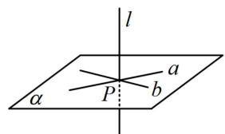
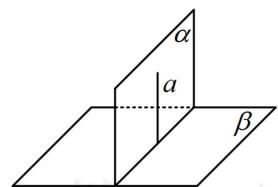
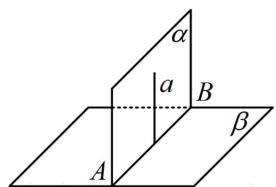
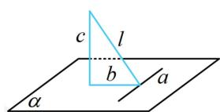
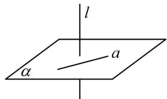
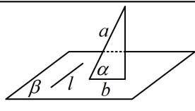

<!-- source-part:1 pages:1-7 -->

# 第2节 垂直关系证明思路大全（★★☆）

## 内容提要

本节主要归纳立体几何大题第一问常见的证明垂直关系的思路，先梳理需要用到的一些定理.

1. 线面垂直的判定定理：如图1，若 $l \perp a$ ， $l \perp b$ ， $a, b \subset \alpha$ ， $a \cap b = P$ ，则 $l \perp \alpha$ 。

2. 面面垂直的判定定理：如图2，若 $a \perp \beta$ ， $a \subset \alpha$ ，则 $\alpha \perp \beta$

3. 面面垂直的性质定理：如图3，若 $\alpha \perp \beta$ ， $\alpha \cap \beta = AB$ ， $a\subset \alpha$ 且 $a\perp AB$ ，则 $a\perp \beta$

4. 三垂线定理：如图4， $a \subset \alpha$ ， $l$ 在 $\alpha$ 内的射影是 $b$ ，若 $a \perp b$ ，则 $a \perp l$ ，此结论反过来也成立.

①作用：如图4，想证明 $l$ 垂直于面 $\alpha$ 内的 $a$ ，只需证 $l$ 在面 $\alpha$ 内的射影与 $a$ 垂直，这就将异面垂直问题转化为了共面垂直问题.注意，三垂线定理在大题中要给出证明过程，再使用.

②定理的证明：因为 $\left\{ \begin{array}{l} c \perp \alpha \\ a \subset \alpha \end{array} \right.$ ，所以 $a \perp c$ ，故 $a \perp b \Leftrightarrow a \perp$ 图中的三角形所在平面 $\Leftrightarrow a \perp l$ .

  
图1

  
图2

  
图3

  
图4

空间中证明垂直关系的常见思路：

1. 证线面垂直: 证明直线垂直于平面内的两条相交直线即可.

2. 证线线垂直: 若线与线是共面的, 则考虑用平面几何的方法来证; 若异面, 如图5, 要证异面直线 $l$ 和 $a$ 垂直, 可证明 $l$ 垂直于 $a$ 所在的某个平面 $\alpha$ , 找到 $\alpha$ 是解决问题的关键, 常用两种方法来找:

①逆推法：把我们要证的结论与给出的某垂直条件结合，看能得出什么样的线面垂直，这样我们就找到了面 $\alpha$ ，再来分析怎么证 $l \perp \alpha$ ，问题就回到前面1的证线面垂直了.

②三垂线定理法: 如图6, 若 $l$ 在平面 $\beta$ 内, $a$ 在 $\beta$ 内的射影 $b$ 很好找, 由三垂线定理, $l \perp b \Leftrightarrow l \perp a$ , 所以 $a$ 和射影 $b$ 构成的平面 (图中三角形所在平面) 即为我们要找的 $\alpha$ .

3. 证面面垂直: 核心是证线面垂直, 若不会找线, 可通过在其中一个面内找与交线垂直的直线, 如上面图 3 中的 $a$ , 找到这条直线, 问题就回到前面 1 的证线面垂直了.

4. 已知面面垂直：常过一个面内的点作交线的垂线，得到线面垂直，再得到我们需要的线线垂直.

  
图5

  
图6

提醒：本节题目只节选了原题中的1个小问，所给条件可能有多余.

![[高中/总复习/教辅/一数常规版2026/第9章 立体几何、空间向量/模块2 位置关系的判定/第2节 垂直关系证明思路大全/类型01_线面垂直的逆推思路/类型01_线面垂直的逆推思路.md]]
![[高中/总复习/教辅/一数常规版2026/第9章 立体几何、空间向量/模块2 位置关系的判定/第2节 垂直关系证明思路大全/类型02_线线垂直的逆推思路/类型02_线线垂直的逆推思路.md]]
![[高中/总复习/教辅/一数常规版2026/第9章 立体几何、空间向量/模块2 位置关系的判定/第2节 垂直关系证明思路大全/类型03_面面垂直判定的逆推思路/类型03_面面垂直判定的逆推思路.md]]
![[高中/总复习/教辅/一数常规版2026/第9章 立体几何、空间向量/模块2 位置关系的判定/第2节 垂直关系证明思路大全/类型04_已知面面垂直的常用辅助线作法/类型04_已知面面垂直的常用辅助线作法.md]]
![[高中/总复习/教辅/一数常规版2026/第9章 立体几何、空间向量/模块2 位置关系的判定/第2节 垂直关系证明思路大全/强化训练/强化训练.md]]
