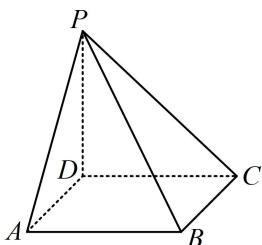

<!-- question-source:start -->
【变式】(2020·新高考Ⅰ卷（节选）)如图，四棱锥P-ABCD的底面为正方形， $PD \perp$ 底面ABCD，设平面PAD与平面PBC的交线为l，证明： $l \perp$ 平面PDC.

<!-- question-source:end -->

![[高中/总复习/教辅/一数常规版2026/第9章 立体几何、空间向量/模块2 位置关系的判定/第2节 垂直关系证明思路大全/类型01_线面垂直的逆推思路/例题/answers/Q00050584A1.md]]
