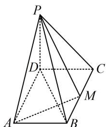

> [!faq]- 《第2节 垂直关系证明思路大全》例题解析
>
> > [!success]- **【答案】** 详见解析
>
> > [!note]- **【分析】**
> > 本题未单列分析。
>
> > [!note]- **【解析】**
> > 证明： $PD \perp$ 平面 ABCD.
> > 证明：（要证结论，只需证 $PD \perp$ 面 ABCD 内的两条相交直线，结合已知的线面垂直可知其中一条选 AM）
> > 因为 $AM \perp$ 平面 PBD， $PD \subset$ 平面 PBD，所以 $AM \perp PD$ ①，
> >
> > 
> >
> > （另一条选谁呢？剩余条件都是长度，用长度证垂直，想到勾股定理， $\triangle PCD$ 就满足勾股定理）因为 $PD = CD = 1$ ， $PC = \sqrt{2}$ ，所以 $PD^2 + CD^2 = 2 = PC^2$ ，故 $PD \perp CD$ ②，
> >
> > $$
> > A M, C D \subset
> > $$
> >
> > $$
> > A B C D
> > $$
>
> > [!tip]- **【反思】**
> > 证线面垂直的核心是找线，这个线一定（隐藏）在条件里，尝试翻译即可.
