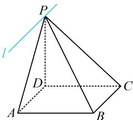

> [!faq]- 《第2节 垂直关系证明思路大全》例题解析
>
> > [!success]- **【答案】** 详见解析
>
> > [!note]- **【分析】**
> > 本题未单列分析。
>
> > [!note]- **【解析】**
> > 证明： $l \perp$ 平面PDC.
> >
> > 
> >
> > 证明: (图中没给交线 $l$ , 需先把它画出来, 注意到 $BC \parallel AD$ , 故画交线可用线面平行的性质定理)由 $ABCD$ 是正方形知 $BC \parallel AD$ , 又 $BC \not\subset$ 平面 $PAD$ , $AD \subset$ 平面 $PAD$ , 所以 $BC \parallel$ 平面 $PAD$ ,
> >
> > 而 $BC \subset$ 平面 $PBC$ ，平面 $PBC \cap$ 平面 $PAD = l$ ，所以 $BC // l$ ，如图，（在面 $PDC$ 内直接找两条与 $l$ 垂直的直线不易，故考虑用 $BC // l$ 来转化为证 $BC \perp$ 平面 $PDC$ ）
> >
> > 因为 $PD \perp$ 底面 $ABCD$ ， $BC \subset$ 底面 $ABCD$ ，所以 $BC \perp PD$ ，
> >
> > 又 $BC \perp CD$ ，且 $PD$ ， $CD \subset$ 平面 $PCD$ ， $PD \cap CD = D$ ，
> >
> > 所以 $BC \perp$ 平面 $PCD$ ，结合 $BC // l$ 可得 $l \perp$ 平面 $PCD$ .
> >
> > 
>
> > [!tip]- **【反思】**
> > 若发现直线 l 与平面 $\alpha$ 内的直线的垂直条件少，则可考虑转化为证 l 的某平行线与 $\alpha$ 垂直.
