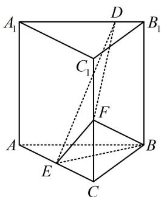

<!-- question-source:start -->
【例 2】(2021·全国甲卷（节选）) 已知直三棱柱 $ABC-A_{1}B_{1}C_{1}$ 中，侧面 $AA_{1}B_{1}B$ 为正方形，AB=BC=2，E，F 分别为 AC 和 $CC_{1}$ 的中点，D 为棱 $A_{1}B_{1}$ 上的点， $BF\perp A_{1}B_{1}$ ，证明： $BF\perp DE$ 。

<!-- question-source:end -->

![[高中/总复习/教辅/一数常规版2026/第9章 立体几何、空间向量/模块2 位置关系的判定/第2节 垂直关系证明思路大全/类型02_线线垂直的逆推思路/例题/answers/Q00050585A1.md]]
