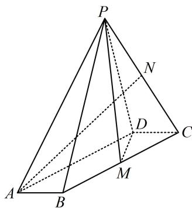

<!-- question-source:start -->
【变式1】(2021·浙江卷（节选）)如图，在四棱锥 $P - ABCD$ 中，底面 $ABCD$ 是平行四边形， $\angle ABC = 120^{\circ}$ ， $AB = 1$ ， $BC = 4$ ， $PA = \sqrt{15}$ ， $M$ ， $N$ 分别是 $BC$ ， $PC$ 的中点， $PD\bot DC$ ， $PM\bot MD$ ，证明： $AB\bot PM$ 证明：（PM在底面的射影不好找，故不用三垂线定理找思路，尝试逆推，有两条路径：①假设 $AB\bot PM$ 成立，结合条件 $PM\bot MD$ 可得 $PM\bot$ 面 $ABCD$ ，故可通过证此线面垂直来证 $AB\bot PM$ ；②假设 $AB\bot PM$ 成立，结合条件 $PD\bot DC$ （即 $PD\bot AB$ ）可得 $AB\bot$ 面 $PDM,$

故可通过证这一线面垂直来证明 $AB \perp PM$ 。对比发现 $AB \perp$ 面 $PDM$ 更好证，可转化为证 $DC \perp$ 面 $PDM$ ，只需在 $\triangle CDM$ 中证 $DC \perp DM$ ）
<!-- question-source:end -->

![[高中/总复习/教辅/一数常规版2026/第9章 立体几何、空间向量/模块2 位置关系的判定/第2节 垂直关系证明思路大全/类型02_线线垂直的逆推思路/例题/answers/Q00050586A1.md]]
