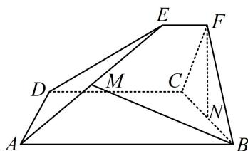

<!-- question-source:start -->
【变式2】（2022·浙江卷（节选））如图，已知ABCD和CDEF都是直角梯形， $AB \parallel DC$ ， $DC \parallel EF$ ，AB=5，DC=3，EF=1， $\angle BAD = \angle CDE = 60^{\circ}$ ，二面角F-DC-B的平面角为 $60^{\circ}$ ，设M，N分别为AE，BC的中点，证明： $FN \perp AD$ .

<!-- question-source:end -->

![[高中/总复习/教辅/一数常规版2026/第9章 立体几何、空间向量/模块2 位置关系的判定/第2节 垂直关系证明思路大全/类型02_线线垂直的逆推思路/例题/answers/Q00050587A1.md]]
