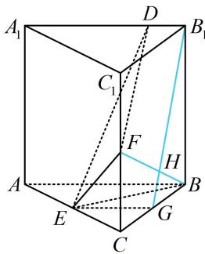

> [!faq]- 《第2节 垂直关系证明思路大全》例题解析
>
> > [!success]- **【答案】** 详见解析
>
> > [!note]- **【分析】**
> > 本题未单列分析。
>
> > [!note]- **【解析】**
> > 证明：（有两个切入点，我们都给出来，切入点1：要证 $BF \perp DE$ ，考虑证明 $BF \perp$
> >
> > $DE$ 所在的某平面. 要找到这个平面, 尝试逆推法, 假设 $BF \perp DE$ 了, 结合条件中还有 $BF \perp A_{1}B_{1}$ , 于是 $BF$ 应 $\perp A_{1}B_{1}$ 和 $DE$ 构成的平面, 此面可扩展为下图中的面 $B_{1}DEG$ , 故考虑证 $BF \perp$ 面 $B_{1}DEG$ .
> >
> > 切入点2：证异面垂直也可用三垂线定理来思考. 观察发现 $BF$ 在右侧面内，而 $DE$ 在右侧面的投影容易找
> >
> > 到，过 $E$ 作右侧面的垂线即得到投影 $B_{1}G$ ，故只需证 $BF \perp$ 平面 $B_{1}DEG$ ）
> >
> > $$
> > B C C _ {1} B _ {1}
> > $$
> >
> > 如图，取 $BC$ 中点 $G$ ，连接 $EG$ ， $B_{1}G$ ，因为 $E$ 为 $AC$ 中点，所以 $EG \parallel AB$ 又 $AB \parallel B_{1}D$ ，所以 $EG \parallel B_{1}D$ ，故 $B_{1}$ ， $D$ ， $E$ ， $G$ 四点共面，（下面证 $BF \perp B_{1}$ 由题意， $CF = 1$ ， $BC = 2$ ，所以 $\tan \angle CBF = \frac{CF}{BC} = \frac{1}{2}$ 又 $BG = 1$ ， $BB_{1} = AB = 2$ ，所以 $\tan \angle BB_{1}G = \frac{BG}{BB_{1}} = \frac{1}{2}$ 所以 $\tan \angle CBF = \tan \angle BB_{1}G$ ，故 $\angle CBF = \angle BB_{1}G$ 因为 $\angle BB_{1}G + \angle BGB_{1} = 90^{\circ}$ ，所以 $\angle CBF + \angle BGB_{1} = 90^{\circ}$ 设 $B_{1}G \cap BF = H$ ，则 $\angle GHB = 90^{\circ}$ ，所以 $BF \perp B_{1}G$ 由题意， $BF \perp A_{1}B_{1}$ ，所以 $BF \perp B_{1}D$ 因为 $B_{1}D$ ， $B_{1}G \subset$ 平面 $B_{1}DEG$ ， $B_{1}D \cap B_{1}G = B_{1}$ ，所以 $BF \perp$ 平面 $B_{1}DEG$ 因为 $DE \subset$ 平面 $B_{1}DEG$ ，所以 $BF \perp DE$ ：
> >
> > 
