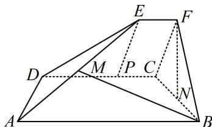

> [!faq]- 《第2节 垂直关系证明思路大全》例题解析
>
> > [!success]- **【答案】** 详见解析
>
> > [!note]- **【分析】**
> > 本题未单列分析。
>
> > [!note]- **【解析】**
> > 证明：（逆推发现题目没有垂直条件，找不到面，怎么办？其实题目的数据隐藏着 $\triangle CFB$ 为等边三角形，于是 $FN \perp BC$ ，故若假设 $FN \perp AD$ ，则 $FN \perp$ 面 $ABCD$ ，这样面就找到了）  
> > 因为 $ABCD$ 和 $CDEF$ 都是直角梯形， $AB // DC, DC // EF, \angle BAD = \angle CDE = 60^\circ$ ，所以 $\angle FCD = \angle BCD = 90^\circ$ ，故 $\left\{ \begin{array}{l} CD \perp CF \\ CD \perp CB \end{array} \right.$ ①，  
> > 所以 $\angle FCB$ 是二面角 $F - DC - B$ 的平面角，由题意， $\angle FCB = 60^\circ$ ，如图，作 $EP \perp CD$ 于 $P$ ，则 $PC = EF = 1$ ， $PD = DC - PC = 2$ ， $PE = PD \cdot \tan \angle EDP = 2\sqrt{3}$ ，所以 $CF = 2\sqrt{3}$ 同理，在直角梯形ABCD中可求得 $BC = 2\sqrt{3}$ ，所以 $BC = CF$ ，故 $\triangle BCF$ 是正三角形，又 $N$ 为 $BC$ 的中点，所以 $FN\perp BC$ ②，
> >
> > 由①结合 $CF$ ， $CB\subset$ 平面 $BCF$ ， $CF\cap CB = C$ 可得 $CD\bot$ 平面 $BCF$ 因为 $FN\subset$ 平面 $BCF$ ，所以 $FN\bot CD$ 结合②以及 $BC$ ， $CD\subset$ 平面ABCD， $BC\cap CD = C$ 可得 $FN\bot$ 平面ABCD又 $AD\subset$ 平面ABCD，所以 $FN\bot AD$ ：
> >
> > 
>
> > [!tip]- **【总结】**
> > - **①**：三垂线定理是证异面直线垂直的好方法，但当投影不易找时会失效；
> > - **②**：逆推法是通法，但有时题干没有其它线线垂直，不易直接逆推线面垂直，此时往往题目数据隐藏着垂直条件，需要仔细挖掘.
