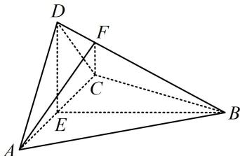

<!-- question-source:start -->
【例 3】(2022·全国乙卷（节选）) 如图，四面体 ABCD 中， $AD \perp CD$ ，AD = CD， $\angle ADB = \angle BDC$ ，E 为 AC 中点，证明：平面 BED ⊥ 平面 ACD.

<!-- question-source:end -->

![[高中/总复习/教辅/一数常规版2026/第9章 立体几何、空间向量/模块2 位置关系的判定/第2节 垂直关系证明思路大全/类型03_面面垂直判定的逆推思路/例题/answers/Q00050588A1.md]]
