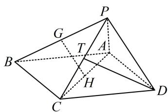

> [!faq]- 《第2节 垂直关系证明思路大全》例题解析
>
> > [!success]- **【答案】** 详见解析
>
> > [!note]- **【分析】**
> > 本题未单列分析。
>
> > [!note]- **【解析】**
> > 证明: (要证线面垂直, 需在面内找两条相交直线与 $PA$ 垂直, 只给了 $PA \perp CD$ , 另一条怎么找? 看到面面垂直的条件, 想到过 $A$ 或 $D$ 作两个面交线 $PC$ 的垂线, 思路就有了)
> >
> > 如图，取 $PC$ 中点 $T$ ，连接 $DT$ ，因为 $\triangle PCD$ 为正三角形，所以 $DT \perp PC$ 又平面 $PAC \perp$ 平面 $PCD$ ，平面 $PAC \cap$ 平面 $PCD = PC$ ， $DT \subset$ 平面 $PCD$ 所以 $DT \perp$ 平面 $PAC$ ，因为 $PA \subset$ 平面 $PAC$ ，所以 $PA \perp DT$ 又 $PA \perp CD$ ，且 $DT$ ， $CD$ 是平面 $PCD$ 内的相交直线，所以 $PA \perp$ 平面 $PCD$ . 【总结】若题目出现面面垂直条件，则过某面内顶点作交线的垂线，寻找想要的线面垂直，是最常见的思路.
> >
> > 
