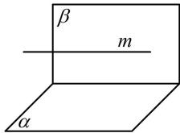
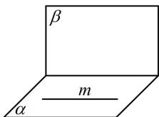
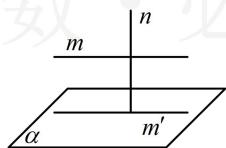
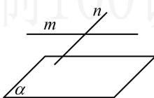

> [!faq]- 《第3节 空间点、线、面的位置关系综合小题》参考答案
>
> > [!success]- **【答案】** C
>
> > [!note]- **【分析】**
> > 本题未单列分析。
>
> > [!note]- **【解析】**
> > C
> >
> > 解析：A 项，如图 1， $\alpha\perp\beta$ ， $m// \alpha$ ，但 m 与 $\beta$ 可以不垂直，故 A 项错误；B 项，如图 2， $\alpha\perp\beta$ ， $m\subset\alpha$ ，但 m 与 $\beta$ 可以不垂直，故 B 项错误；
> >
> >   
> > 图1
> >
> >   
> > 图2
> >
> > C 项，如图 3，可以想象，当 $m \parallel \alpha$ ， $n \perp \alpha$ 时， $m \perp n$ 成立，下面给出严格的证明，因为 $m \parallel \alpha$ ，所以 $\alpha$ 内存在与 $m$ 平行的直线 $m'$ ，因为 $n \perp \alpha$ ， $m' \subset \alpha$ ，所以 $n \perp m'$ ，又 $m \parallel m'$ ，所以 $m \perp n$ ，故 C 项正确；
> >
> > D 项，如图 4， $m \perp n$ ， $m \parallel \alpha$ ，但 n 与 $\alpha$ 可以不垂直，故 D 项错误.
> >
> >   
> > 图3
> >
> >   
> > 图4
