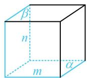
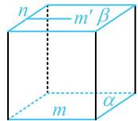
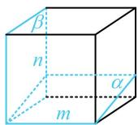

> [!faq]- 《第3节 空间点、线、面的位置关系综合小题》参考答案
>
> > [!success]- **【答案】** BC
>
> > [!note]- **【分析】**
> > 本题未单列分析。
>
> > [!note]- **【解析】**
> > 解析：条件中有平行、垂直、异面，直接想象不易，而正方体中有这些位置关系，故考虑用正方体来分析，
> > A 项，如图 1 所示的情形满足 $l \perp \alpha$ ，l 与 m，n 都垂直，但 $m \subset \alpha$ ，故 A 项错误；
> > B 项，图 1 所示的情形即为满足 B 选项的一种情况，故 B 项正确；
> > C 项，如图 2，图中画出了一对互相平行的平面 $\alpha$ ， $\beta$ ，且 $m \subset \alpha$ ， $n \subset \beta$ ，除此之外，没有其它满足要求的平行平面了，这是因为由 $\alpha \parallel \beta$ ， $m \subset \alpha$ 可得 $m \parallel \beta$ ，所以在 $\beta$ 内必定存在直线 $m'$ 与 m 平行，由于 m，n 是异面直线，所以 $m'$ 与 n 相交，两条相交直线可唯一确定一个平面 $\beta$ ，同理， $\alpha$ 也是唯一的，故 C 项正确；
> > D 项，如图 3 和图 4，m，n， $\beta$ 是一样的， $\alpha$ 不同，都能满足 $\alpha \perp \beta$ ， $m \subset \alpha$ ， $n \subset \beta$ ，故 D 项错误.
> >
> >   
> > 图1
> >
> >   
> > 图3
> >
> > 
> >
> > 图2  
> >   
> > 图4
