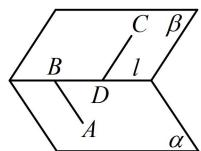
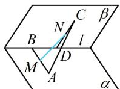
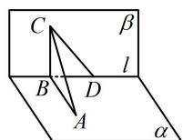
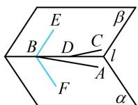

> [!faq]- 《第3节 空间点、线、面的位置关系综合小题》参考答案
>
> > [!success]- **【答案】** ABD
>
> > [!note]- **【分析】**
> > 本题未单列分析。
>
> > [!note]- **【解析】**
> > 解析：A项，如图1，ABCD是空间四边形，不是平行四边形，故A项错误；  
> > B项，如图2，MN和AC是异面直线，故B项错误；  
> > C项，给出了两个线线垂直，先用它们推线面垂直，  
> > 如图3， $\left\{ \begin{array}{l}AB\perp l\\ AC\perp l \end{array} \right.\Rightarrow l\perp$ 平面 $ABC\Rightarrow l\perp BC$ 结合 $\alpha \perp \beta$ 可得 $BC\perp \alpha$ ，所以 $CD$ 在 $\alpha$ 上的射影是 $BD$ ，故C项正确；  
> > D项，由二面角的平面角的定义可得D项错误，若不放心，可考虑极端情况，  
> > 如图4，在二面角 $\alpha -l - \beta$ 中，假设 $AB,CD$ 都近似与 $l$ 重合，则直线 $AB,CD$ 所成的角就接中的∠EBF是其平面角)，故D项错误.
> >
> > $$
> > \alpha - l - \beta
> > $$
> >
> >   
> > 图1
> >
> > 
> >
> >   
> > 图3
> >
> > 图2  
> >   
> > 图4
