<!-- source-part:1 pages:1-3 -->

# 第 3 节 空间点、线、面的位置关系综合小题（★★☆）

内容提要

本节题目解题的一般方法是根据题干的描述进行空间想象, 画出图形, 判断正误. 画图的基本顺序是: 先画面面, 再画线面, 最后添线; 若较难想象, 也可借助常见几何体 (如正方体等) 来辅助判断.

【例 1】设 $\alpha$ ， $\beta$ 为两个平面，则 $\alpha \parallel \beta$ 的充要条件是（）
A. $\alpha$ 内有无数条直线与 $\beta$ 平行
B. $\alpha$ 内有两条相交直线与 $\beta$ 平行
C. $\alpha$ ， $\beta$ 平行于同一条直线
D. $\alpha$ ， $\beta$ 垂直于同一平面

解析：由面面平行的判定定理可以得出B项正确，其余选项为什么错，我们画图来解释，如图1， $\alpha$ 内有 $a, b, c$ 等无数条平行线均与 $\beta$ 平行，但 $\alpha$ 与 $\beta$ 不平行，故A项错误；如图2， $\alpha$ 和 $\beta$ 都与直线 $a$ 平行，但 $\alpha$ 与 $\beta$ 不平行，故C项错误；如图3， $\alpha$ 和 $\beta$ 都与 $\gamma$ 垂直，但 $\alpha$ 与 $\beta$ 不平行，故D项错误.

答案: B

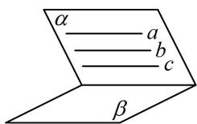  
图1

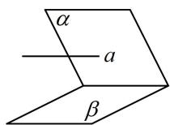  
图2

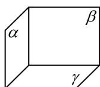  
图3

【例 2】（多选）已知 m，n 是不同的直线， $\alpha$ ， $\beta$ 是不同的平面，则下列命题中正确的有（）

A. 若 $m \parallel \alpha$ ， $m \parallel \beta$ ， $\alpha \cap \beta = n$ ，则 $m \parallel n$ B. 若 $m \parallel n$ ， $n \subset \alpha$ ，则 $m \parallel \alpha$ C. 若 $m \perp \alpha$ ， $n \perp \beta$ ， $m \perp n$ ，则 $\alpha \perp \beta$ D. 若 $m \perp \alpha$ ， $m \perp n$ ， $\alpha \parallel \beta$ ，则 $n \parallel \beta$

解析：A 项，如图 1，可以想象 A 项正确，若要证明，由于已知线面平行，故用线面平行的性质定理，在 $\alpha$ 内取不与 $n$ 重合的直线 $m'$ ，使 $m // m'$ ，则 $m' // \beta$ ，因为 $m' \subset \alpha$ ， $\alpha \cap \beta = n$ ，所以 $m' // n$ ，故 $m // n$ ；B 项，观察发现判定线面平行的条件不够，还差 $m \not\subset \alpha$ ，故 B 项错误，如图 2；C 项，如图 3，由图可知 C 项正确；D 项，有面面平行，可先画两个平行的平面，再往里面添线，如图 4， $n$ 可以在 $\beta$ 内，故 D 项错误。

答案: AC

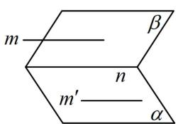  
图1

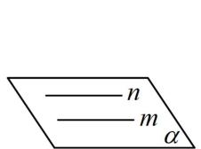  
图2

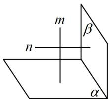  
图3

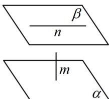  
图4

【例3】（多选）已知 $m, n$ 是两条不同的直线， $\alpha, \beta$ 是两个不同的平面，则下列说法错误的是

( )

A. 若 $m \perp \alpha, \alpha \perp \beta$ ，则 $m \parallel \beta$ B. 若 $m \parallel \alpha, \alpha \parallel \beta$ ，则 $m \parallel \beta$ C. 若 $m \subset \alpha, n \subset \alpha, m \parallel \beta, n \parallel \beta$ ，则 $\alpha \parallel \beta$ D. 若 $m \perp \alpha, m \perp \beta, n \perp \alpha$ ，则 $n \perp \beta$

解析：A 项，有面面关系 $\alpha \perp \beta$ ，先画这两个面，再画线 $m$ ，如图1， $m$ 可以在 $\beta$ 内，故A项错误；B项，有面面关系 $\alpha // \beta$ ，先画它们，再由 $m // \alpha$ 画 $m$ ，如图2， $m$ 可以在 $\beta$ 内，故B项错误；C项，没说 $m$ ， $n$ 相交，不能判定 $\alpha // \beta$ ，如图3，故C项错误；D项，如图4，D项正确.

答案: ABC

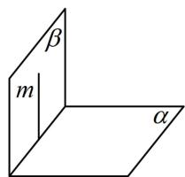  
图1

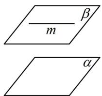  
图2

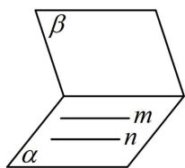  
图3

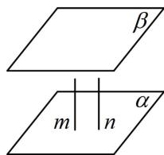  
图4

【总结】可以发现，此类题问法多种多样，但我们总是画出草图辅助判断。需注意：想证明选项错误只需一个反例，想说明正确则需要严格的论证，这需要记准所有判定与性质定理。

![[高中/总复习/教辅/一数常规版2026/第9章 立体几何、空间向量/模块2 位置关系的判定/第3节 空间点、线、面的位置关系综合小题/强化训练/强化训练.md]]
