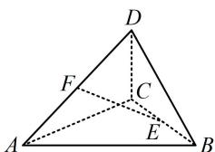

> [!faq]- 《第1节 空间向量的基本运算》参考答案
>
> > [!success]- **【答案】** A
>
> > [!note]- **【分析】**
> > 本题未单列分析。
>
> > [!note]- **【解析】**
> > 解析：空间基底表示和平面基底表示方法类似，往与基向量关联较强的向量上化即可，如图， $\overrightarrow{EF} = \overrightarrow{EB} +\overrightarrow{BA} +\overrightarrow{AF} = \frac{1}{2}\overrightarrow{CB} -\overrightarrow{AB} +\frac{1}{2}\overrightarrow{AD} = \frac{1}{2} (\overrightarrow{AB}-$ $\overrightarrow{AC}) - \overrightarrow{AB} +\frac{1}{2}\overrightarrow{AD} = -\frac{1}{2}\overrightarrow{AB} -\frac{1}{2}\overrightarrow{AC} +\frac{1}{2}\overrightarrow{AD} = \frac{1}{2} (\pmb {c} - \pmb {a} - \pmb {b}).$
> >
> > 
