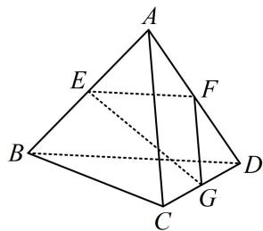

<!-- question-source:start -->
【例1】（多选）如图，已知四面体ABCD所有棱长均为2， $E$ ， $F$ ， $G$ 分别为棱 $AB$ ， $AD$ ， $DC$ 的中点，则下列说法正确的有（ ）A. $\overrightarrow{AB}$ 与 $\overrightarrow{CD}$ 不共面 B. $\overrightarrow{AB} +\overrightarrow{BC} -\overrightarrow{GC} -\overrightarrow{EG} = \overrightarrow{EB}$ C. $\overrightarrow{AB}\cdot \overrightarrow{AC} = 2$ D. $\overrightarrow{EF}\perp \overrightarrow{FG}$

<!-- question-source:end -->

![[高中/总复习/教辅/一数常规版2026/第9章 立体几何、空间向量/模块3 空间向量及其应用/第1节 空间向量的基本运算/类型01_空间向量的运算/例题/answers/Q00050599A1.md]]
