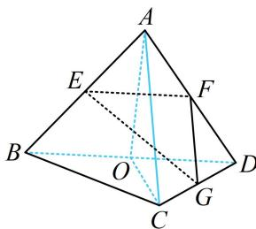

> [!faq]- 《第1节 空间向量的基本运算》例题解析
>
> > [!success]- **【答案】** BCD
>
> > [!note]- **【分析】**
> > 本题未单列分析。
>
> > [!note]- **【解析】**
> > 解析：A项，向量可以平移，空间中任意两个向量都可平移到同一平面上去，故A项错误；  
> > B项， $\overrightarrow{AB} +\overrightarrow{BC} -\overrightarrow{GC} -\overrightarrow{EG} = \overrightarrow{AB} +\overrightarrow{BC} +\overrightarrow{CG} +\overrightarrow{GE} = \overrightarrow{AE} = \overrightarrow{EB}$ ，故B项正确；  
> > C项， $\overrightarrow{AB}\cdot \overrightarrow{AC} = |\overrightarrow{AB} |\cdot |\overrightarrow{AC} |\cos \angle BAC = 2\times 2\times \cos 60^{\circ} = 2$ ，故C项正确；
> >
> > D 项，若熟悉正三棱锥对棱垂直的结论，则可快速判断，这一性质前面小节已有提及，下面先证明，如图，取 BD 中点 O，连接 OA，OC，
> > 则 $BD \perp OA$ ， $BD \perp OC$ ，所以 $BD \perp$ 平面 AOC，故 $BD \perp AC$ ，
> > 接下来做本题就简单了，显然 EF，FG 都可利用中位线性质转到对棱，
> > 又 $EF \parallel BD$ ， $FG \parallel AC$ ，所以 $EF \perp FG$ ，从而 $\overrightarrow{EF} \perp \overrightarrow{FG}$ ，故 D 项正确.
> >
> >
> > 
