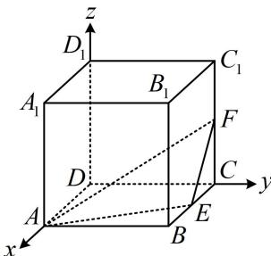

> [!faq]- 《第1节 空间向量的基本运算》例题解析
>
> > [!success]- **【答案】** ABD
>
> > [!note]- **【分析】**
> > 本题未单列分析。
>
> > [!note]- **【解析】**
> > A. $A_{1}C \perp AB_{1}$ B. $A_{1}B$ 与 $AD_{1}$ 所成的角为 $60^{\circ}$ C. $DD_{1} \perp AF$ D. 平面 AEF 的一个法向量为 $m = (4, 2, 4)$
> >
> > 
> >
> > 解析：A 项，判断两直线是否垂直，只需看它们的方向向量数量积是否为 0，
> >
> > $$
> > A B = 2
> > $$
> >
> > $$
> > B _ {1} (2, 2, 2)
> > $$
> >
> > $$
> > \overrightarrow {A _ {1} C} = (- 2, 2, - 2)
> > $$
> >
> > $$
> > \overrightarrow {A B _ {1}} = (0, 2, 2)
> > $$
> >
> > $$
> > \overrightarrow {A _ {1} C} \cdot \overrightarrow {A B _ {1}} = - 2 \times 0 + 2 \times 2 + (- 2) \times 2 = 0
> > $$
> >
> > $$
> > A _ {1} C \perp A B _ {1}
> > $$
> >
> > B项，求线线角，可用两直线的方向向量算夹角余弦， $B(2,2,0)$ ， $D_{1}(0,0,2)$ ， $\overrightarrow{A_{1}B}=(0,2,-2)$ ， $\overrightarrow{AD_{1}}=(-2,0,2)$ 。
> > 所以 $\left|\cos<\overrightarrow{A_{1}B},\overrightarrow{AD_{1}}> \right|=\frac{\left|\overrightarrow{A_{1}B}\cdot\overrightarrow{AD_{1}}\right|}{\left|\overrightarrow{A_{1}B}\right|\cdot\left|\overrightarrow{AD_{1}}\right|}=\frac{4}{2\sqrt{2}\times2\sqrt{2}}=\frac{1}{2}$ ，从而 $A_{1}B$ 与 $AD_{1}$ 所成的角为 $60^{\circ}$ ，故B项正确；
> > C项， $F(0,2,1)$ ， $\overrightarrow{DD_{1}}=(0,0,2)$ ， $\overrightarrow{AF}=(-2,2,1)$ ，所以 $\overrightarrow{DD_{1}}\cdot\overrightarrow{AF}=2\neq0\Rightarrow DD_{1}$ 与AF不垂直，故C项错误；
> > D项， $E(1,2,0)$ ， $\overrightarrow{AE}=(-1,2,0)$ ，设平面AEF的法向量为 $n=(x,y,z)$ ，则 $\begin{cases}n\cdot\overrightarrow{AE}=-x+2y=0\\n\cdot\overrightarrow{AF}=-2x+2y+z=0\end{cases}$
> >
> > 此方程组有无数组解，任取一组非零解，都可以得到法向量，故对其中一个变量赋值，求另外两个，令 $x = 2$ 可得 $y = 1$ ， $z = 2$ ，所以 $\pmb {n} = (2,1,2)$ 是平面 $AEF$ 的一个法向量，与 $\pmb{n}$ 共线的非零向量都是法向量，而 $\pmb {m} = (4,2,4) = 2\pmb{n}$ ，所以 $\pmb{m}$ 也是平面 $AEF$ 的法向量，故D项正确.
>
> > [!tip]- **【反思】**
> > 求法向量是流程化的步骤，务必熟悉，且为了计算方便，宜把法向量调整为不含分数的形式.
