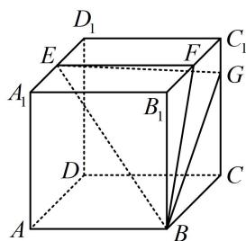

<!-- question-source:start -->
1. (2025·天津卷·★★★)

正方体 $ABCD - A_{1}B_{1}C_{1}D_{1}$ 的棱长为4， $E$ ， $F$ 分别为 $A_{1}D_{1}$ ， $B_{1}C_{1}$ 的中点， $G$ 在棱 $CC_{1}$ 上，且 $CG = 3C_1G$

(1) 求证: $GF \perp$ 平面 $EBF$ ;

(2) 求平面 EBF 与平面 EBG 夹角的余弦值;

(3) 求三棱锥 D-BEF 的体积.

注：由于空间向量计算比较无脑，所以以下题目选取均具有一定灵活性.
<!-- question-source:end -->

![[Q00050613A1]]
