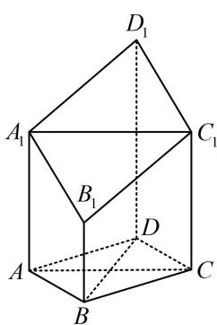

<!-- question-source:start -->
2. (2024·广西模拟·★★★)

在六面体 $ABCD - A_{1}B_{1}C_{1}D_{1}$ 中， $AA_{1} \perp$ 平面 $ABCD$ ， $AA_{1} \parallel BB_{1} \parallel CC_{1} \parallel DD_{1}$ ，且底面 $ABCD$ 为菱形.

(1) 证明: $BD \perp$ 平面 $ACC_{1}A_{1}$ ;

（2）若 $AA_{1} = CC_{1} = \frac{7}{2}$ ， $\angle BAD = 60^{\circ}$ ， $AB = BB_{1} =$

2，求平面 $A_{1}B_{1}C_{1}D_{1}$ 与平面ABCD所成二面角的正弦值.

<!-- question-source:end -->

![[Q00050614A1]]
