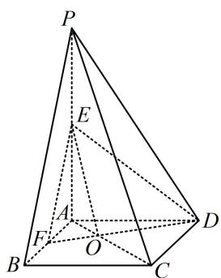

<!-- question-source:start -->
## 3. (2022·山东模拟·★★★)

如图，在四棱锥 $P - ABCD$ 中，底面 $ABCD$ 为正方形， $AB = 2$ ， $AP = 3$ ，直线 $PA \perp$ 平面 $ABCD$ ， $E$ ， $F$ 分别为 $PA$ ， $AB$ 的中点，直线 $AC$ 与 $DF$ 相交于点 $O$ .

（1）证明：OE 与 CD 不垂直；

(2) 求二面角 B - PC - D 的余弦值.

<!-- question-source:end -->

![[Q00050615A1]]
