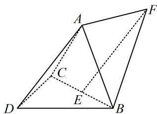

<!-- question-source:start -->
5. (2023·新课标II卷·★★★)

如图，三棱锥 A-BCD 中，DA=DB=DC， $BD\perp CD$ ， $\angle ADB=\angle ADC=60^{\circ}$ ，E 为 BC 的中点.

(1) 证明: $BC \perp DA$ ;

（2）点 $F$ 满足 $\overrightarrow{EF} = \overrightarrow{DA}$ ，求二面角 $D - AB - F$ 的正弦值.

<!-- question-source:end -->

![[Q00050617A1]]
