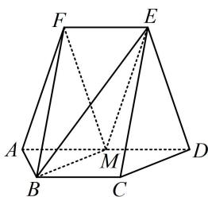

<!-- question-source:start -->
6. (2024·全国甲卷·★★★☆)

如图，在以 $A, B, C, D, E, F$ 为顶点的五面体中，四边形ABCD与四边形ADEF均为等腰梯形， $EF \parallel AD$ ， $BC \parallel AD$ ， $AD = 4$ ， $AB = BC = EF = 2$ ， $ED = \sqrt{10}$ ， $FB = 2\sqrt{3}$ ， $M$ 为 $AD$ 的中点.

(1) 证明: $BM \parallel$ 平面 $CDE$ ;

(2) 求二面角 F - BM - E 的正弦值.

<!-- question-source:end -->

![[Q00050618A1]]
