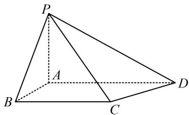

<!-- question-source:start -->
7. (2025·全国Ⅰ卷·★★★☆)

如图所示的四棱锥 $P - ABCD$ 中， $PA \perp$ 平面 $ABCD$ ， $BC \parallel AD$ ， $AB \perp AD$ .

（1）证明：平面 $PAB \perp$ 平面 $PAD$ ;

（2）若 $PA = AB = \sqrt{2}$ ， $AD = \sqrt{3} +1$ ， $BC = 2$ ， $P$ ， $B$ ， $C$ ， $D$ 在同一个球面上，设该球面的球心为 $O$

(i) 证明: $O$ 在平面 $ABCD$ 上;

（ii）求直线 $AC$ 与直线 $PO$ 所成角的余弦值.

<!-- question-source:end -->

![[Q00050619A1]]
