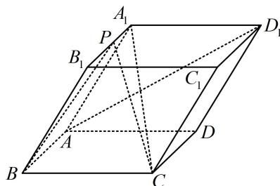

<!-- question-source:start -->
## 8. (2023·广东深圳模拟·★★★★)

在四棱柱 $ABCD - A_{1}B_{1}C_{1}D_{1}$ 中，底面 $ABCD$ 为正方形，侧面 $ADD_{1}A_{1}$ 为菱形，且平面 $ADD_{1}A_{1} \perp$ 平面 $ABCD$ .

(1) 证明: $AD_{1} \perp A_{1} C$ ;

（2）设点 $P$ 在棱 $A_{1}B_{1}$ 上运动，若 $\angle A_{1}AD = \frac{\pi}{3}$ ，且 $AB = 2$ ，记直线 $AD_{1}$ 与平面 $PBC$ 所成的角为 $\theta$ ，当 $\sin \theta = \frac{1}{4}$ 时，求 $A_{1}P$ 的长度.

<!-- question-source:end -->

![[Q00050620A1]]
